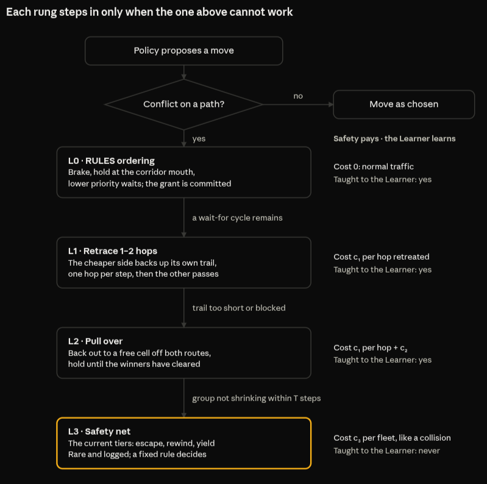

# FLOWRRA v2 — The Conflict Ladder

Rohit Tamidapati · 5 October 2026

## Why

The late storms in teacher\_run1 were not crashes: they were two controllers fighting over the same fleets, and neither looked at paths. Collisions stayed under 1 per episode late in the run; recoveries reached 249 in episode 110.

What the 115 episodes showed:

- **The recovery head became a coin flip.** Its value errors grew to about 2, while a needless ask costs about 0.06. It asked for recovery 69–458 times an episode with nothing at risk, and its preemptions cleared fleets 3–5% of the time, down from 30–50%. aws\_run4 shows a milder version (errors about 0.4, 77 wasted asks) without any teacher.
- **Holds locked RULES out.** RULES' action applies only to a fleet that is not held. In storm episodes, hold overrides outnumbered RULES overrides 5–12 to 1; in healthy ones RULES led about 5 to 1.
- **The tiers do not look at paths.** Tier 1 moves a fleet one cell by density, Tier 2 rewinds positions, Tier 3 picks the fleet closest to its goal. The fleets then steer back along the same converging routes.
- **Fairness without commitment livelocked.** Between fleets 7 and 73 in episode 110 the winner changed 30 times in 31 decisions. Each win lasted one 5-step hold, so neither got through.
- **The margin teacher drifted the values.** It pushed down moves that are never executed, so nothing pulled them back up; `qval_safety` fell from 0.0 to −6.6 while real safety penalties shrank.
- **A padding bug** fed dummy fleets into the recovery head's view of the floor in training. Fixed in step 1 (masked pooling).

## Principles

One ladder of path-aware RULES moves replaces the position-based tiers, and each learned head does one job.

1. **Three jobs in three heads.** Safety, Delivery and Efficiency forecast consequences. A Learner head learns RULES' judgement and speaks only inside conflicts. When the ladder itself fails, a fixed rule steps in (L3); the learned recovery head is parked. They combine only at choice time.
2. **RULES are the tiers.** Every intervention is a RULES move, chosen from the routes the fleets intend, not from where they stand.
3. **Freedom first.** A fleet moves as its policy chooses until its move conflicts on a path. The ladder steps in early, not after a crash.
4. **Physics.** Every move is one hop per step at driving speed, retreats included. No jumps.
5. **Commitment.** Once a fleet is granted passage, it keeps it until it has cleared the conflict.
6. **Pay by consequence.** A fleet pays for the rung its move made necessary, never for following a rule.
7. **Values stay honest.** Nothing but real rewards ever moves a Q-value.

## Definitions

Five objects, all built from what the code already computes.

| Term | Meaning | Already in the code |
| --- | --- | --- |
| Route πᵢ | The next H = 8 cells fleet *i* intends, one set per step (ties branch) | `density._intended_path`, used by path warnings |
| Conflict group | Fleets whose routes meet within the horizon, joined transitively | Union-find in the simultaneous step |
| Wait-for graph W | An arrow *i → j* when *j* holds, or is committed to, a cell on πᵢ before *i* reaches it | Pair labels in `conflict_warehouse.py` (`head_on`, `blocked`, `following`, `contested`) |
| Retreat distance rᵢ | Hops *i* must reverse along its own trail until it is off every route in its group | New: trail = last positions, kept per fleet |
| Priority key | hops to goal − 0.25 × steps waited, then seniority, then a fixed tie-break | `ConflictRules.key` |

The key fact behind the ladder is standard in deadlock theory: **a group whose W has no cycle resolves by waiting alone; only a cycle needs someone to retreat.** Waiting never resolves a cycle, so at least one fleet in it must physically back up.

## Classification

Every conflict group is sorted by its size and the shape of its wait-for graph; that alone decides the lowest rung that can work.

| Group | Path label | Wait-for graph | What resolves it | Rung |
| --- | --- | --- | --- | --- |
| 2 fleets | following | one arrow, gap steady or growing | Braking only | L0 |
| 2 fleets | following, gap closing | one arrow | Brake the follower | L0 |
| 2 fleets | contested (one shared cell) | a chain A → B | Ordering: the lower key waits | L0 |
| 2 fleets | blocked (one is stationary) | a chain A → B | Wait; if the blocker is dead, route around (yield to stopped) | L0 |
| 2 fleets | head-on, at a corridor mouth | would become A ⇄ B | Corridor-entry hold: the entering fleet waits outside | L0 |
| 2 fleets | head-on, already committed | a 2-cycle A ⇄ B | One fleet retreats | L1 or L2 |
| 3+ fleets | any, no cycle | a chain or tree | Ordering, leaders first (topological order) | L0 |
| 3+ fleets | any, with cycles | one or more cycles | One retreat per cycle, then ordering | L1 or L2 |

Two-fleet conflicts are the common case and are fully covered by rules that already exist, except the 2-cycle outside a corridor. Multi-fleet conflicts are new territory: today they fall straight to the position-based tiers.

For 3+ fleets with cycles, the fewest-retreats choice is a feedback-vertex-set problem, which is hard in general. Groups here hold 2–5 fleets, so trying every option is cheap; above 6 fleets, break each cycle at its cheapest member, one cycle at a time.

## The ladder

Four rungs, each tried only when the one above cannot resolve the group; ordinary traffic never leaves L0.

<div align="center"> 
   <br></br>
</div>

The triggers between rungs are structural (a cycle, a blocked trail, no progress in T steps), never a learned head's guess. Only L3 uses today's tiers, and Tier 2 stays there as the last resort.

## Rules

Four rules decide every rung: who retreats, how long a grant lasts, how waiting is rewarded, and who outranks whom.

**Who retreats: the cheapest retreat, not the furthest from goal.** If side A backs out, the cost is about twice its retreat (out and back) plus the time for B to pass; B barely waits. A side is the fleet and every fleet following it, as in today's corridor back-out. So retreat the side with the smaller total:

```math
R(S) = \sum_{f \in S} r_f, \qquad \text{retreat } \arg\min_{S \in \{A, B\}} R(S)
```

Ties go by priority key, then the fixed tie-break. Example: A is one hop outside a junction, B is inside the corridor heading out. R(A) = 1, R(B) ≥ 2, so A steps back one hop and B comes out.

**Commitment.** A grant holds until the winner's route no longer meets the loser's within the horizon. No new decision is made on that pair while a grant stands. Today's corridor retreat orders already work this way; the recovery tiers' alternation rule does not, which is what looped 7 and 73.

**One grace check before a retreat.** A cycle is spotted from routes up to 8 cells ahead, so it starts as a standoff, not a crash. On first detection, L0 holds both sides and their policies get one chance to break it; if the cycle is still there at the next check, L1 acts. A fleet that backs off on its own pays no rung cost, so Safety learns that resolving early is free. Exception: a cycle first spotted with the fleets already adjacent goes straight to L1.

**Aging, per conflict.** Every step a fleet is made to wait raises its priority by 0.25 hops, but only within its current conflict: the count resets once the fleet has been out of every warned pair for 3 steps. Aging exists to stop starvation inside a conflict. Carried across a whole trip, as today (reset only on delivery), an old wait lets a fleet outrank one a cell from its goal in an unrelated conflict. Without it, the fleet that clears soonest goes first, which minimises total waiting.

**Precedence.** From highest to lowest:

1. L3 safety-net actions (rare, only after the ladder has failed)
2. Ladder orders: retreats, pull-over holds, corridor holds, ordering waits
3. The fleet's own policy

A recovery hold never silences a ladder order. Holds themselves become ladder orders, so there is one authority in a warning zone instead of two. This removes the `and not _held` lock-out in `core_warehouse.py`.

## Why it terminates

With commitment and aging, a conflict group of n fleets clears within n grants, and no fleet waits forever. A sketch, to be turned into tests:

1. **No cycle.** Order the group by W (leaders first). The leader's next cell is free of the group, so it moves. Each committed grant ends with that fleet past every route it met, so the group shrinks by at least one.
2. **Cycle.** At least one fleet per cycle retreats along its own trail. The trail is cells it occupied, so those cells were reachable, and reversing frees the cell the next fleet in the cycle needed. The cycle becomes a chain, which step 1 clears.
3. **No starvation.** A waiting fleet's key falls by 0.25 per step, so after a bounded wait it outranks every competitor it can still meet.
4. **No livelock.** A grant cannot be reversed mid-passage (commitment), so the 7/73 pattern, winner changing every decision, cannot occur.

Where the argument can fail, and what catches it:

- A retreat trail is blocked, because another fleet is now standing on it. Then try the other side of the cycle.
- Both sides are blocked, or a group fails to shrink within T steps. Then fall to L3 and log it.
- A dead (failed) fleet sits on a trail. Dead fleets are fixed obstacles and are never part of a cycle; they route the live fleets around.

## The three heads

Each head has one job and one training signal, and only the choice step combines them.

| Head | Its job | Trained by | Used where |
| --- | --- | --- | --- |
| Safety, Delivery, Efficiency | Forecast the consequences of a fleet's own move | TD on real rewards only | Choice: weighted sum 6 : 4 : 1, as today |
| Learner (new, step 3) | Learn RULES' judgement: what the ladder would do here | Supervised, on every L0–L2 decision | Choice only, and only for a fleet inside a conflict group: its preference is added with weight β. Silent in free traffic, where it was never taught. Never inside a Q-value or a target |
| Recovery | Decide when the ladder has failed | TD on the holon signal; frozen while the ladder runs | Parked: L3 is a fixed rule. If L3 proves common, it can learn when to fire L3 and which tier, acting only if Q(act) − Q(none) > δ |

**Safety pays by rung.** Costs are charged to the fleets the event involved, through the per-fleet ledger that already runs in shadow mode:

| Rung | What happened | Safety cost |
| --- | --- | --- |
| L0 | Ordering, braking, corridor hold | 0 (normal traffic) |
| L1 | Retraced 1–2 hops | c₁ per hop retreated |
| L2 | Retreat to a pull-over cell | c₁ per hop + c₂ |
| L3 | Safety net fired | c₃ per fleet involved, about one collision |

The values c₁, c₂ and c₃ get calibrated against the existing safety terms before any run. Paying the retreating fleet only would punish the fleet that solved the conflict, so every fleet in the group shares the cost. The share is weighted by path: fleets in the conflict group pay 1.0, fleets whose route heads into the conflict's cells pay 0.25, and everyone else pays 0. Distance alone would charge bystanders, such as a fleet parked nearby or driving away. A fleet that routes itself around a jam pays nothing, so the cost teaches good routing, not just escaping.

**Recovery head: frozen under the ladder, with two fixes ready if it returns.** If unfrozen, it acts only when "act" beats "none" by a margin δ larger than its value noise, so a coin flip defaults to doing nothing. And it gets its own small encoder over the fleets' raw features, so the fleet heads' drift cannot change what it sees. A stop-gradient alone would not do this: it only stops the recovery head from disturbing the shared trunk, not the trunk from disturbing it.

## What happens to the teacher

The margin teacher is retired; its idea continues as the Learner head: the ladder teaches, the Learner learns, and a paired test decides whether that head earns its place.

- **Why Safety alone is not enough.** With the ladder, Safety pays only for escalations, so it learns what to avoid. L0 ordering costs nothing, so Safety has no reason to learn it, and RULES would stay as permanent traffic control. That is most of RULES' everyday judgement, and the policy would never absorb it.
- **Why both, not one.** The Learner learns what RULES would do here: dense, fast, but capped at RULES' level. Safety learns what happens if I do this: slower, but it is how the policy can beat RULES, by avoiding conflicts upstream before the ladder ever acts. The Learner speaks only inside a conflict group, where it has been taught; in free traffic the three consequence heads decide alone, so it never interrupts the flow.
- **The bleeding, made measurable.** As the Learner's agreement rises, RULES overrides fall. The override rate across training is the number that shows RULES moving into the policy.
- **The margin switch** (`training.teacher_margin.enabled`) stays in the code, set to off, so teacher\_run1 can be reproduced. Its write-up records it as tried and replaced, with the reason: it pushed on values that no experience could correct.
- **The test.** First the ladder and Safety costs with the Learner off; then the same run with the Learner on. If L0 overrides do not fall, the Learner head is not doing its job.

**Ladder context: letting fleets see the ladder.** The Learner can only learn a back-off if a fleet can tell it is in a situation that needs one, and today its observation cannot show that waiting will not help. Step 3 adds four signals to every fleet's observation. All four are knowable from its neighbours' broadcasts, so nothing becomes central.

| Signal | What it tells the fleet | Values |
| --- | --- | --- |
| In a cycle | Waiting alone cannot resolve my conflict | 0 or 1 |
| Steps in this conflict | How long my group has been stuck | Count, divided by T |
| Group's rung | How far the ladder has escalated | L0–L3, one-hot |
| Cheaper side to back out | My side's retreat cost against the other side's | Ratio; below 1 means my side is cheaper |

With these, the reflex becomes learnable from a fleet's own view, the way a good driver reads the road: facing another fleet in a single lane, closer to the junction, so reverse now, before the ladder has to order it. A back-off that starts before any ladder order also costs nothing (the grace check), so Safety rewards the same reflex the Learner copies. The signals enlarge the network's input, which v2 can absorb because it trains from scratch.

Tracked: **self-initiated back-offs**, where a fleet reverses with no ladder order. As the reflex forms, they rise while RULES-ordered retreats fall.

## Build order, switches and tests

Three steps, each behind its own switch and each off by default, so a run with every switch off reproduces today exactly.

| Step | What lands | Switch | Its own test |
| --- | --- | --- | --- |
| 1 (done) | Masked pooling for the graph-level heads | none: a bug fix | `test_graph_pooling.py` |
| 2a | Ladder: wait-for graph, retreat by cheapest side, commitment, retrace one hop per step, one authority (no hold lock-out) | `conflict.ladder` | `test_ladder.py`: scripted 2-fleet head-on, 3-fleet cycle, blocked trail, the 7/73 replay |
| 2b | Recovery head frozen under the ladder (done); margin δ and its own encoder only if it is unfrozen later | `conflict.ladder` (freezes it) | `test_recovery_frozen.py` |
| 2c | Safety pays by rung (per-fleet ledger goes live) | `training.rung_costs` | `test_rung_costs.py` |
| 3 | Learner head, silent outside conflict groups, and the ladder-context signal in every fleet's observation | `training.learner` | `test_learner_head.py` |

The run plan:

1. Paired dry runs per switch (2 episodes, seed 0, same instances, switch off vs on), as with the teacher margin.
2. One long run with 2a, 2b and 2c on and the Learner off, on all\_scens\_v5, both maps, 25/40/60 fleets.
3. The same run with the Learner on. The difference between 2 and 3 is the Learner head's contribution.
4. The frozen shock benchmark, with every arm re-run on the new code. RULES alone is re-run too, because the ladder changes RULES.

## Measurements and predictions

Each prediction is written before the runs and judged against teacher\_run1 on the same metric; a miss gets reported, not reworded.

| Prediction | teacher\_run1 (late) | Pass if |
| --- | --- | --- |
| Endgame loops end | max repeats per pair: 70 | ≤ 3 in every episode |
| No flip-flopping | winner changes per pair: 30 in 31 | ≤ 1 per pair per conflict |
| The ladder resolves conflicts itself | recoveries: 51 per episode | L3 fires < 2 per episode |
| The recovery head stops coin-flipping | wasted asks: 69–458 per episode | < 10 per episode |
| Values stay honest | qval\_recovery −15, qval\_safety −6.6 | both within ±1 for the whole run |
| Delivery holds | completion 97–99% | ≥ 97% in every 20-episode block |
| Safety holds | collisions under 1 per episode | no worse |
| Bleeding (run 3 only) | not measured | L0 overrides fall across training, while the Learner's agreement rises; self-initiated back-offs rise as RULES-ordered retreats fall |
| The verdict | policy + RULES 67–70% vs RULES 85–87% | on the re-run shock benchmark, policy + RULES ≥ RULES alone |

New counters the CSV needs: rung per intervention (L0–L3), retreat hops, grant flips per pair, groups by size and cycle count, time-to-clear per group, self-initiated back-offs (a fleet reverses with no ladder order), and the four ladder-context signals.

## Decisions

All six open questions are decided; δ and β take their values from paired dry runs.

- [x] **Recovery head at L3: a fixed rule first.** If a group has not shrunk within T steps, collapse. The learned head stays in the code, switched off, and every L3 event is logged; if L3 proves common, that data will train it. Training on denser maps just to make L3 common would defeat the ladder.
- [x] **Lifts: retrace allowed.** Edges are two-way, so a fleet can back up or down the way it came instead of going out, waiting and coming back in. A shaft of single-lane cells is a corridor, so the entry rule orders fleets at its mouth.
- [x] **Trail length: 8 cells,** the route horizon. Simple and light to compute.
- [x] **T: 2 × the group's largest retreat distance + 10 steps.**
- [x] **δ and β.** δ sits above the recovery head's measured value noise, so a coin flip defaults to doing nothing. β starts small and is set by a paired dry run.
- [x] **Stream mode.** A fleet driving to its exit dock is a normal group member at full weight; at zero weight it would learn to push through on its way out. Once it has left the floor it drops out, and the group re-checks its cycles.

## Code map

Most of the ladder extends code that already exists; the genuinely new parts are the wait-for graph, the retreat-cost choice and the per-fleet trail.

| File | Change | New or extended |
| --- | --- | --- |
| `conflict_warehouse.py` | Build W from the pair verdicts; find cycles per group | Extended |
| `corridor_warehouse.py` | `_new_meetings` generalised from corridors to any 2-cycle; loser chosen by R(S), not priority key; retrace order type alongside pull-over | Extended |
| `core_warehouse.py` | Remove the `and not _held` lock-out; per-fleet trail; rung counters; one authority in warning zones; ladder-context features in each fleet's state (3) | Extended |
| `recovery_warehouse.py` | Tiers 1–3 called only at L3; Tier 2 kept as the safety net | Narrowed |
| `agent_warehouse.py` | Recovery head frozen under the ladder (2b, done); Learner head (3) | New heads |
| `config_warehouse.py` | `conflict.ladder`, `conflict.ladder.shadow`, `training.rung_costs`, `training.learner`, all off | New switches |
| `main_runner_warehouse.py` | Log rung counts, flips and retreat hops per episode | Extended |
