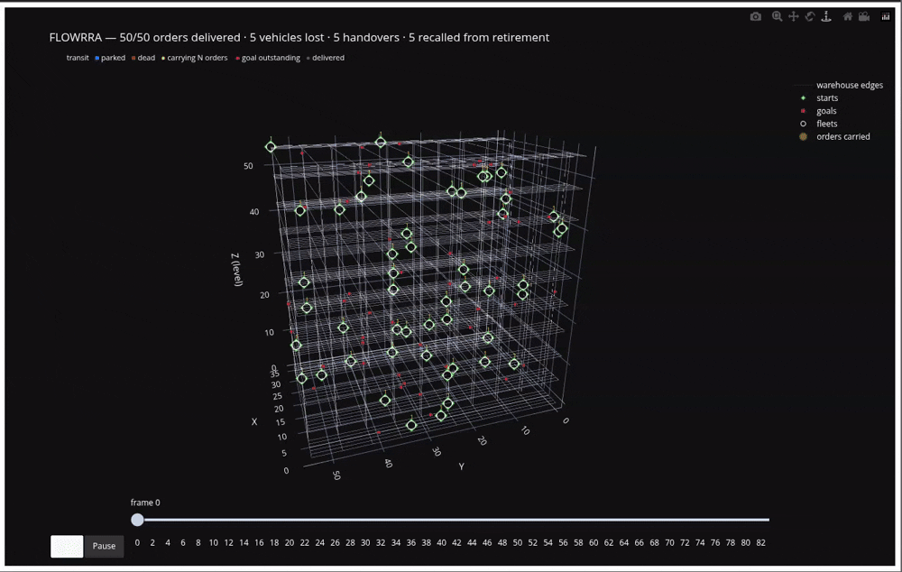
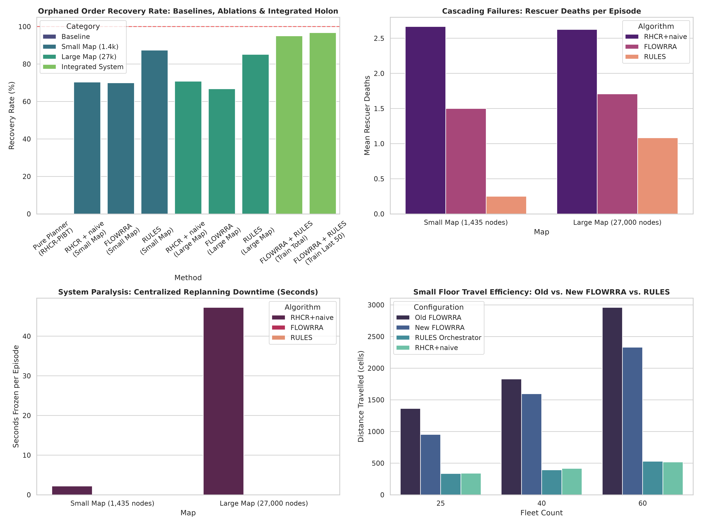

# FLOWRRA Warehouse

**Decentralized coordination for warehouse vehicle fleets.** A rule-based orchestrator (RULES) and a learned graph policy share the work of moving fleets through multi-level warehouses. They also handle recovery when vehicles fail mid-delivery, and they do it without a central replanning step.

FLOWRRA (Flow Recognition Reconfiguration Agent) is an independent research project by [DhaaRn](https://dhaarn.com). This folder holds its warehouse work.

> **Start here: [`FLOWRRA_Warehouse_V2/`](FLOWRRA_Warehouse_V2/) is the current version.** Everything else in this folder belongs to the previous version and is kept as a fixed reference point.

---
<div align="center"> 
   <br></br>
</div>

## Headline result: recovering from vehicle failures

Each vehicle decides locally from what it perceives within 5 graph hops. When a vehicle dies with an order on board, another vehicle takes the order over, and the rest of the floor keeps moving.

The benchmark tests how well that works under heavy failure. It has **48 paired instances**: 2 maps × 25, 40 and 60 vehicles × 8 seeds (0, 3–9). In every episode **9 vehicles are killed in 3 waves**. Every method runs the same instances with the same task allocation.

- **Small map:** `25_5_2_5_2_1`, 1,435 nodes
- **Large map:** `50_20_5_10_5_2`, 27,000 nodes, multi-level

Both maps come from the 3D MAPF warehouse dataset (Wang, Veerapaneni, Wu, Li & Likhachev, ICAPS 2024).

| small / large map | RHCR-PIBT + nearest-idle recovery | FLOWRRA (policy + RULES, frozen weights) | RULES orchestrator alone |
|---|---|---|---|
| Stranded orders recovered | 70.4% / 70.8% | 70.0% / 66.8% | **87.4% / 85.2%** |
| Rescue vehicles lost per episode | 2.67 / 2.62 | 1.50 / 1.71 | **0.25 / 1.08** |
| Orders completed overall | 92.3% / 92.5% | 93.0% / 93.0% | **95.0% / 97.0%** |
| Replanning time per episode | 2.2 s / 47.2 s | none (no replanning step) | none (no replanning step) |

The comparison of RULES against RHCR-PIBT + nearest-idle uses paired Wilcoxon signed-rank tests. For recovery, p = 0.0009 on the small map and p = 0.0013 on the large one. For rescue vehicles lost, p < 0.001 on both maps, with 91% fewer losses on the small map and 59% fewer on the large one.



*The benchmark at a glance. In the recovery panel, the two right-most bars ("Train") come from training logs, not from this benchmark. See the note below.*

**About the baseline.** `RHCR-PIBT` is a rolling-horizon planner that follows the mechanism of Li et al. (AAAI 2021). It was reimplemented in Python for this harness; it is not the authors' tuned C++ code. "Nearest-idle recovery" sends each stranded order to the nearest idle vehicle.

### What this shows, and what it doesn't

- **The orchestrator carries the recovery.** Its rules (below) keep the corridors around a failure moving. That lets rescuers reach stranded orders without becoming casualties themselves.
- **The learned policy doesn't yet add value on top of the rules under failure shocks.** With the policy in the loop, recovery is 67–70%, below the rules alone (paired p = 0.003 on the small map and p < 0.001 on the large one). This is a known issue with a diagnosis and a fix in progress; see the next section.
- **No replanning pause is not the same as no compute.** FLOWRRA spends decision time on every step rather than in replanning bursts. A per-step compute comparison against central replanning, broken down by map size, is on the roadmap.
- **The article's 95% figure.** "Evolution towards Harmony" reports 95% recovery, which comes from training logs: 191 of 201 stranded orders were delivered over 150 episodes, with exploration still on. That is about 1.3 stranded orders per episode, against 8–9 per episode here. It is a different, lighter regime and can't be compared with the table above.

**Data:** [`benchmark_new_all_2.csv`](FLOWRRA_Warehouse_V2/benchmark_new_all_2.csv) has one row per method × instance. The summary is in [`summary_table_for_article.csv`](FLOWRRA_Warehouse_V2/summary_table_for_article.csv), and the figures come from [`generate_benchmark_figures.py`](FLOWRRA_Warehouse_V2/generate_benchmark_figures.py).

### Known issue, in progress: the policy under failure shocks

With the learned policy in the loop, recovery under failure shocks is 67–70%, below the 85–87% the rules reach alone. We're treating this as an issue to fix. The working hypothesis has two parts.

**The policy has had no way to learn from being overridden.** When RULES overrides the policy, training records the action RULES executed. The action the policy proposed is never recorded, so the policy is never told its choice was vetoed, and it keeps preferring moves RULES has to veto. Training logs are consistent with this. In warning zones, the network proposes waiting 12–17% of the time while waits are executed 61–70% of the time, and the gap does not close over 60 episodes (cold_run25).

**The policy hasn't practised this regime.** Training saw about 1.3 stranded orders per episode; the benchmark has 8–9. Under the policy, rescuers also take the long way: 84 hops to reach a stranded order, against 23 for the rules on the small map. That leaves them exposed when the next failure wave hits.

**Being built and tested:**

1. A training signal from every override. On steps where RULES overrides the policy, an extra loss term pushes the value of the rules' action above the value of the policy's own proposal (as in DQfD, Hester et al., 2018). This moves RULES' judgement into the policy's weights.
2. Training with failure waves, on seeds the benchmark doesn't use.

**How it will be judged (decided before the runs):**

- The gap between proposed and executed waits should shrink during training.
- Recovery hops should fall toward the rules'.
- Frozen policy + RULES should match or beat RULES alone on the same 48 instances.

The result will be posted here either way.

---

## Continuous operation (training runs, not yet a frozen benchmark)

In rolling-order operation, the learned policy has shown measurable value on top of the rules. These numbers come from paired training runs, not yet from a frozen benchmark.

**Rolling orders** on map `50_5_5_10_5_2` (6,300 cells, 10 floors), 60 vehicles, 60 paired episodes. Details: [`COLD_RUN25_ANALYSIS.md`](FLOWRRA_Warehouse_V2/COLD_RUN25_ANALYSIS.md).

| | before the conflict redesign (cold_run24) | V2 (cold_run25) |
|---|---|---|
| Deliveries per episode | 131.7 | **191.6** (+45%, better in 60 of 60) |
| Collisions per 100 deliveries | 48 | **19** |

At this density, V2 reached 47% of the conflict-free ideal on the ±3 order window (48% in episodes 24–50). A shortest-path driver running the same rules reached 42%. The conflict-free ideal is what the fleet would deliver if no two vehicles ever met; nothing reaches it in dense traffic. The 42% comes from the driver's capacity runs ([`BENCHMARK.md`](FLOWRRA_Warehouse_V2/BENCHMARK.md)), so a frozen, paired comparison is the next step.

**Fixed missions** on map `25_5_2_5_2_1`, 46 vehicles, 60 identical instances. Details: [`Cold_Run23.md`](FLOWRRA_Warehouse_V2/Cold_Run23.md).

| | before (cold_run23) | V2 (aws_run1) |
|---|---|---|
| Completion | 0.876 | **0.983** |
| Episodes with every order delivered | 0 of 60 | **29 of 60** |
| Collisions per episode | 8.25 | **2.28** |

---

## What changed in V2

The full reasoning is in the article and in V2's design notes.

- **RULES orchestrator.** Six conflict rules, each behind its own switch:
  - **Path-based warnings:** pairs of vehicles are classified by where they are heading over an 8-hop route horizon (head-on, blocked, contested…), not by how close they are.
  - **Directional braking:** a vehicle brakes only while the gap is shrinking, so steady convoys keep moving.
  - **Corridor entry:** a vehicle won't enter a single-lane stretch while another vehicle inside is coming toward it.
  - **Priority:** the vehicle nearest its goal goes first, adjusted for waiting time (`hops − 0.25 × wait_steps`). The loser backs out and pulls over.
  - **Yield to stopped vehicles** and **node-aligned moves.**

  See [`CONFLICT_DESIGN.md`](FLOWRRA_Warehouse_V2/CONFLICT_DESIGN.md), [`conflict_warehouse.py`](FLOWRRA_Warehouse_V2/conflict_warehouse.py) and [`corridor_warehouse.py`](FLOWRRA_Warehouse_V2/corridor_warehouse.py).
- **Simultaneous step.** Every vehicle proposes its move from the same snapshot. Conflicts are grouped into independent components (union-find), and contested components are resolved jointly by Hungarian assignment with order-invariant tie-breaks. No vehicle wins a cell just by coming earlier in a list. See [`Simultaneous_Step.md`](FLOWRRA_Warehouse_V2/Simultaneous_Step.md) and `measure_order_dependence.py`.
- **Reward: five heads down to three.** The heads are safety, delivery and efficiency. Each head learns on its own reward component, and they are weighted 6 : 4 : 1 at action selection only. Safety penalises closing speed inside a shrinking gap, not mere proximity. See [`Reward_Design.md`](FLOWRRA_Warehouse_V2/Reward_Design.md).
- **Gibbs affordance field.** Floor density is modelled as P(cell) ∝ exp(−E(cell)/T), normalised with log-sum-exp. Perception uses graph distance (5 hops), so a vehicle behind a rack no longer counts as a neighbour. See `density_warehouse.py` and `proximity_warehouse.py`.
- **Recovery fixes.** The rescue path now works in continuous (stream) mode, and the recovery cost is charged once (it used to be charged twice). See `test_stream_failures.py`.
- **Measurement.** Each episode records how often the network proposed waiting and how often a wait was actually executed. That lets the policy be judged apart from the rules. See [`WHAT_CHANGED.md`](FLOWRRA_Warehouse_V2/WHAT_CHANGED.md).

---

## Folder guide

```
FLOWRRA_Warehouse/
├── FLOWRRA_Warehouse_V2/        current version: code, tests, design notes, V2 benchmark data
├── FLOWRRA_Benchmark/           previous version's failure benchmark: scripts, CSV, figures
├── all_scens_v2/                scenarios used by the previous version
├── ckpt_pilot2/, ckpt_pilot3/   previous-version checkpoints
├── training_figures/, figs_dist/  previous-version training and distance figures
├── Flowrra_animation.mp4        animation of a run (animated_flowrra.py)
└── *.py, *.csv                  previous-version code and results
```

The previous benchmark in `FLOWRRA_Benchmark/` used different maps (`25_10_5_10_5_2`, `50_20_5_10_5_2`), 50 vehicles, 10 seeds and no RULES arm. Its numbers can't be compared directly with V2's.

**Inside `FLOWRRA_Warehouse_V2/`:**

| Area | Files |
|---|---|
| Simulator and policy | `core_warehouse.py`, `node_warehouse.py`, `loop_warehouse.py`, `density_warehouse.py`, `agent_warehouse.py`, `encoder_warehouse.py`, `recovery_warehouse.py`, `proximity_warehouse.py`, `obstacles_warehouse.py` |
| RULES | `conflict_warehouse.py`, `corridor_warehouse.py` |
| Configuration | `config_warehouse.py`, plus the `config_benchmark_*.py` snapshots used for specific runs |
| Training | `main_runner_warehouse.py` |
| Benchmarks | `benchmark_all_new.py`, `benchmark_flowrra_new.py`, `baselines_mapf_new.py`, `drive_shortest_path.py`, `benchmark_report.py`, `generate_benchmark_figures.py` |
| Kiva / published maps | `convert_grid_map.py`, `kiva_instances.py`, `run_kiva.py` |
| Diagnostics | `check_identity.py`, `lesion_harness.py`, `radius_study.py`, `measure_order_dependence.py`, `profile_step.py` |
| Tests | `test_*.py` |
| Design notes | `CONFLICT_DESIGN.md`, `Simultaneous_Step.md`, `Reward_Design.md`, `Stream_Design.md`, `Path_Awareness.md`, `Target_Network.md`, `Calibration.md`, `DESIGN_PROPOSAL.md`, `FLOWRRA_QuickReference.md`, `Flowrra_Architecture.html` |
| Benchmarks and runs | `BENCHMARK.md`, `WHAT_CHANGED.md`, `Cold_Run23.md`, `COLD_RUN25_ANALYSIS.md` |

---

## Running it

Install Python 3 and the dependencies:

```bash
pip install numpy pandas networkx torch scipy matplotlib seaborn
cd FLOWRRA_Warehouse/FLOWRRA_Warehouse_V2
```

Kiva runs also need `pogema`. It's safest to install it in a separate environment, because it pins numpy 1.26.

**Tests.** Each test file ends with `ALL PASS`:

```bash
for t in test_*.py; do python "$t"; done
```

**Maps.** The maps aren't stored in this repo. They come from the 3D MAPF warehouse dataset, which is linked from the [mapf.info benchmarks page](https://mapf.info/index.php/Main/Benchmarks). The scripts read each map as a nodes CSV and an edges CSV from `all_maps/`, and read scenarios from an `all_scens*/` folder. `generate_scenarios.py` builds the scenarios.

**Turning RULES on.** The six conflict switches are off by default in `config_warehouse.py`, so earlier runs stay reproducible. `config_benchmark_rules.py` has all six on: copy it over `config_warehouse.py`. Scripts that accept overrides can also take them directly (`drive_shortest_path.py --arm`, `run_kiva.py --set`).

**The failure benchmark** (the headline table):

```bash
python benchmark_all_new.py --maps 25_5_2_5_2_1,50_20_5_10_5_2 \
    --agents 25,40,60 --seeds 0,3,4,5,6,7,8,9 \
    --methods FLOWRRA,RULES,RHCR-PIBT+naive \
    --fail --fail-waves W1,W2,W3 --fail-agents 3 \
    --checkpoint CHECKPOINT.pth --out benchmark_new_all_2.csv
```

**Training.** Run `python main_runner_warehouse.py --help` to see every option. For example, this is the fixed-mission reference run:

```bash
python main_runner_warehouse.py --seed 0 --maps 25_5_2_5_2_1 --scens-dir all_scens_v3 \
    --episodes 60 --agent-sets 46 --max-steps 800
```

Add `--cold-start` when training from scratch.

**Capacity runs, reports and Kiva.** See [`BENCHMARK.md`](FLOWRRA_Warehouse_V2/BENCHMARK.md).

---

## Roadmap

1. **Continuous-flow benchmark against RULES:** frozen weights, paired episodes, failures on.
2. **Obstacles:** people in aisles and unmapped blockages, the cases a planner can't prepare for.
3. **The policy earning its place:** a collision-cost recovery reward, with every training run judged against RULES on the same instances.
4. **Learning while deployed:** the policy keeps learning in operation, with the orchestrator as its safety guardrail.
5. **Kiva, using Follower's lifelong protocol:** throughput on their exact 60 instances, reported together with the physics difference (POGEMA has no braking or collisions).
6. **Compute microbenchmark:** per-step decision cost against central replanning, by map size.
7. **Workshop paper** on the orchestrator ablation.

---

## About

FLOWRRA is an independent research project by Rohit Tamidapati ([DhaaRn](https://dhaarn.com)). I designed the system and the experiments, and I built it with heavy AI assistance. I hold the work to a few practices: frozen benchmarks, paired comparisons, predictions written down before runs, and correcting the record in public when a result doesn't hold.

I'd love to do this kind of work inside a team facing these problems at scale. If you run a fleet and want to see how FLOWRRA behaves on your layout, or have a view on how it should be tested, I'd like to hear from you through [dhaarn.com](https://dhaarn.com).

**Writing**

- [FLOWRRA in Warehouse: Evolution towards Harmony](https://rohittamidapati.substack.com/p/flowrra-in-warehouse-evolution-towards) covers V2.
- [FLOWRRA: Flow Recognition Reconfiguration Agent](https://open.substack.com/pub/rohittamidapati/p/flowrra-flow-recognition-reconfiguration) covers the concept.

## License

AGPL-3.0. See [LICENSE.md](../LICENSE.md).
